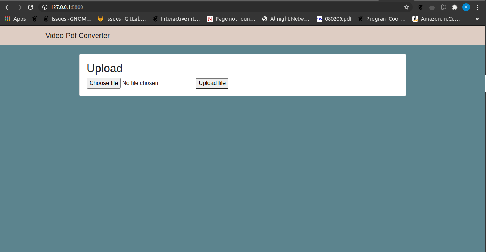
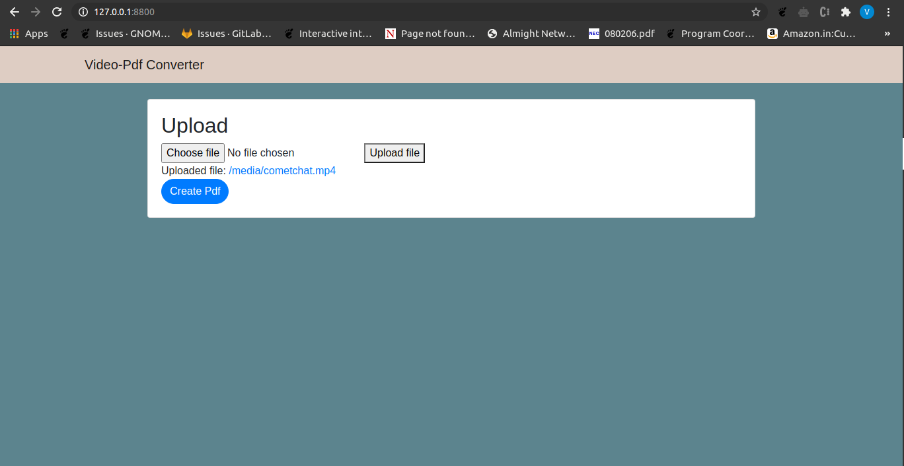
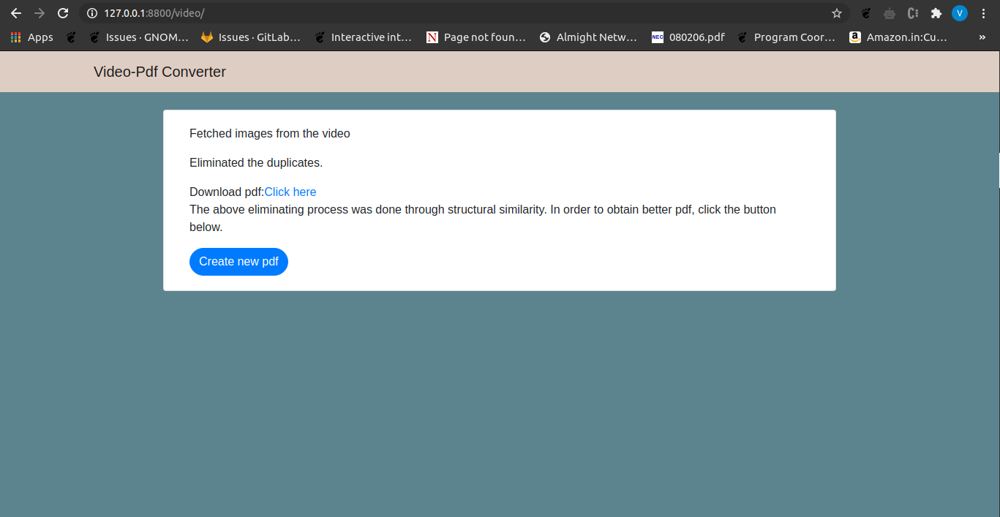
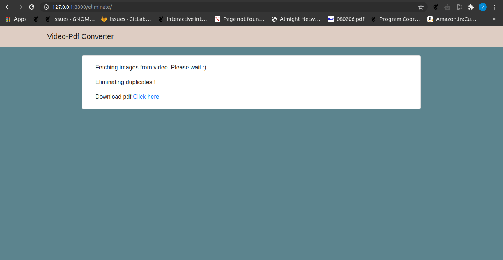

# Video-pdf-webapp

<h3>Building process</h3>

Step1: Clone this repo into your local machine

Step2: cd into that repo and run <strong>pip3 install -r requirements.txt</strong>

Step3: Run <strong>python3 manage.py migrate</strong>

Step4: Run <strong>python3 manage.py runserver</strong>

<h3>Sample execution</h3>

After going throught the building procedure above, your homepage would be a simple submission form, where you submit your .mp4 or .mov file.

After uploading, you'll be given the option to create the pdf.

After clicking the "Create Pdf" button, the procedure will take place and take the video throught the first phase of image retrieving and elimination. After executing those procedures, it will compile all images into a pdf. <strong>Note that this pdf will not have any duplicates from an algorithm point of view but might have similar images from a human perspective.</strong> 

If you want to have a shorter pdf with absolutely no duplicates, then click the "Create new Pdf" button. The output pdf will be shorter and have less content, but the images will be absolutey different.

The app should be running on your localhost and if any problem arise, please create an issue.
